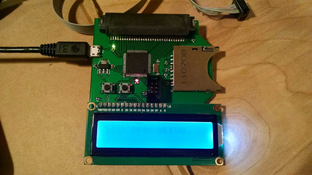
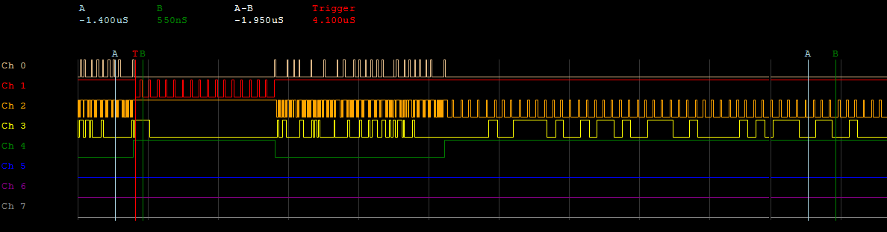
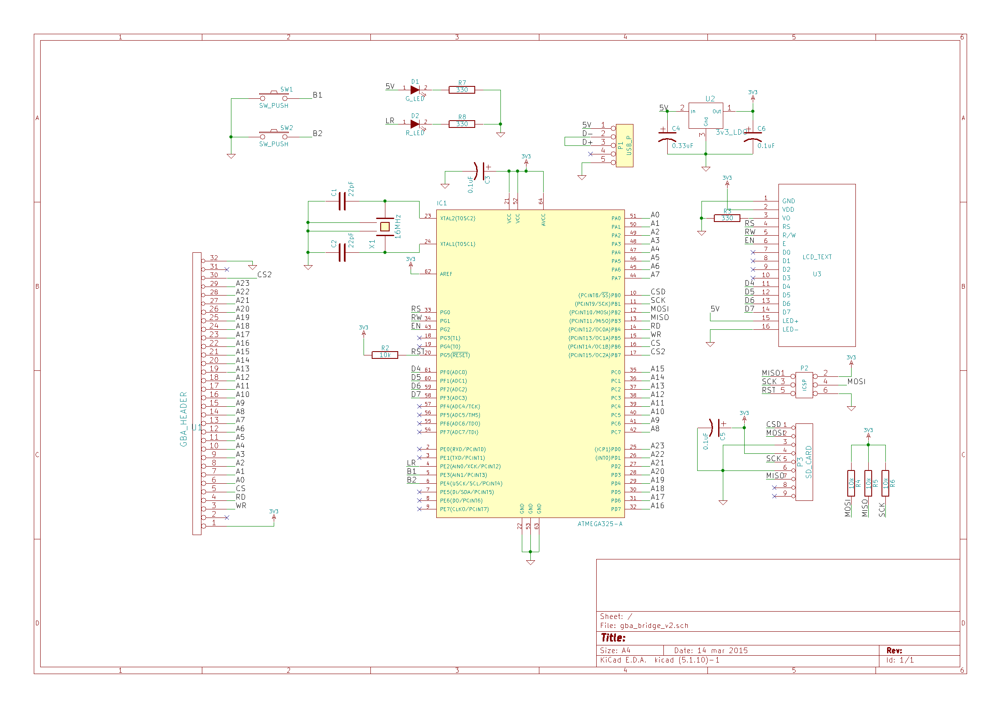
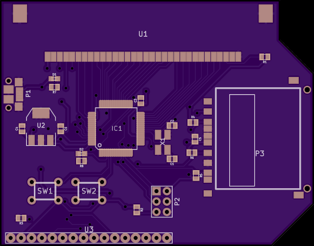

# GBA Bridge Project

Gameboy Advance cartridge data read/write to/from SD card

## Overview

This AVR ATMega325 microcontroller-based project is capable of extracting ROM and RAM from Gameboy Advance (GBA) cartridges and saving them to an SD card. It is also capable of uploading RAM to a gameboy cartridge from a file on the SD card, allowing transfer of save data from one cartridge to another. Supported RAM types include EEPROM, Flash, FRAM, and SRAM of varying memory sizes.



An simple LCD provides feedback to the user concerning mode and operation, controlled with two simple pushbuttons. The USB micro connection provides power, but does not transmit data. Improvements to this design might omit the SD card and physical UI, and implement the read/write feature entirely by way of USB connection.

Some reverse-engineering of transmission protocol was necessary to successfully communicate with GBA cartridge 8-pin EEPROM chips. This was made possible by tying each pin to a digital oscilloscope while the game was active, and triggering on save/load commands issued within the game.



In the current version, the user must examine the game cartridge internal circuit board to ascertain the type of memory used. Improvements to the code might add functionality which auto-detects RAM type and read/writes as desired.

Data extracted from the GBA cartridge is available as a .sav file on the SD card. To upload a .sav file to the RAM on a GBA cartridge, a file called up.sav containing the data should be placed on the SD card and then the appropriate steps followed in the UI of the board.

## Code

The main project file gba_bridge.c depends on separate header and source files to control peripheral devices, including the GBA cartridge. The collective C code was written and compiled in AVR Visual Studio 6, and the resulting .hex file uploaded to the board using *avrdude* through ICSP. 

The code consists of an extended state machine as a function of user input through the two onboard pushbuttons.

```c
	/* Continual Loop */
	/* This state machine cycles through options indicated */
	/* by user input about course of computation action.   */
	/* State machine states:			*/
	/* 0: Introductory screen			*/
	/* 1: Read from ROM select			*/
	/* 2: Read RAM select EEPROM 8k		*/
	/* 3: Read ROM select 2MB			*/
	/* 4: Read RAM select EEPROM 512	*/
	/* 5: Write RAM select okay			*/
	/* 6: Read ROM select 4MB			*/
	/* 7: Read ROM select 8MB			*/
	/* 8: Read ROM select 16MB			*/
	/* 9: Read ROM select 32MB			*/
	/* 10: Execute Read ROM 2MB			*/
	/* 11: Execute Read ROM 4MB			*/
	/* 12: Execute Read ROM 8MB			*/
	/* 13: Execute Read ROM 16MB		*/
	/* 14: Execute Read ROM 32MB		*/
	/* 15: Read RAM select Flash		*/
	/* 16: Read RAM select F/SRAM		*/
	/* 17: Execute RAM read EEPROM 8k	*/
	/* 18: Execute RAM read	EEPROM 512	*/
	/* 19: Execute RAM write EEPROM 512	*/
	/* 20: Execute RAM read Flash		*/
	/* 21: Execute RAM read F/SRAM		*/
	/* 22: Execute RAM write EEPROM 8k	*/
	/* 23: Execute RAM write Flash		*/
	/* 24: Execute RAM write F/SRAM		*/
	/* 25: Write RAM select EEPROM 512	*/
	/* 26: Write RAM select EEPROM 8k	*/
	/* 27: Write RAM select Flash		*/
	/* 28: Write RAM select F/SRAM		*/
```

## Schematic

The schematic and PCB CAD files as developed in KiCad provide the required components and connections of the design. It may be necessary to compatibility update the older files to newer KiCad format.





## License

MIT © 2014 John Greenwell